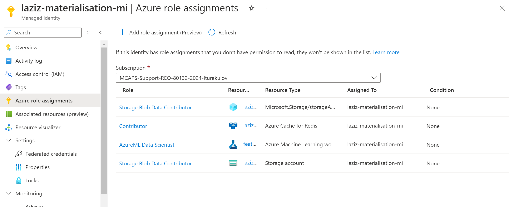

# Azure Machine Learning - Feature Store (CLI Setup)

Ready to boost your machine learning projects? Azure Machine Learning (Azure ML) offers a centralised repository called _**Feature Store**_ to simplify feature engineering. It lets you store, manage and efficiently reuse features across projects, saving time and efforts.

This guide will show you how to set up an Azure ML Feature Store with online and offline materialisation using the **Azure CLI** (Az CLI). Online store is powered by in-memory capacity of _Azure Redis Cache_, while offline store utilises 2nd generation of Azure Data Lake Store (_ADLS Gen2_).

Here's what you'll need:
- An Azure subscription,
- Az CLI installed (we'll cover its extension installation in the first step).

## Table of contents:
- [Step 1: Installing Az CLI's ML extension](https://github.com/LazaUK/AzureML-FeatureStore-CLI#step-1-installing-az-clis-ml-extension)
- [Step 2: Creating ADLS Gen2 storage account](https://github.com/LazaUK/AzureML-FeatureStore-CLI#step-2-creating-adls-gen2-storage-account)
- [Step 3: Creating container on ADLS Gen2 storage](https://github.com/LazaUK/AzureML-FeatureStore-CLI#step-3-creating-container-on-adls-gen2-storage)
- [Step 4: Creating Redis Cache instance](https://github.com/LazaUK/AzureML-FeatureStore-CLI#step-4-creating-redis-cache-instance)
- [Step 5: Creating user-assigned Managed Identity](https://github.com/LazaUK/AzureML-FeatureStore-CLI#step-5-creating-user-assigned-managed-identity)
- [Step 6: Creating Azure ML feature store](https://github.com/LazaUK/AzureML-FeatureStore-CLI#step-6-creating-azure-ml-feature-store)
- [HOUSEKEEPING: Deleting feature store](https://github.com/LazaUK/AzureML-FeatureStore-CLI#housekeeping-deleting-feature-store)

## Step 1: Installing Az CLI's ML extension
To interact with Azure ML through Az CLI, you need to install ML extension:
``` Bash
az extension add --name ml
```

## Step 2: Creating ADLS Gen2 storage account
Now create an ADLS Gen2 account, that will be used as a default storage account by your feature store:
``` Bash
az storage account create --name <STORAGE_ACCOUNT_NAME> --enable-hierarchical-namespace true --resource-group <RESOURCE_GROUP_NAME> --location <AZ_REGION> --subscription <AZ_SUBSCRIPTION_ID>
```
> Note: Replace ```<STORAGE_ACCOUNT_NAME>```, ```<RESOURCE_GROUP_NAME>```, ```<AZ_REGION>``` and ```<AZ_SUBSCRIPTION_ID>``` with required Storage account values.

## Step 3: Creating container on ADLS Gen2 storage
Once you created Storage account, you can setup a blob container that will be used by the feature store for offline materialisation:
``` Bash
az storage fs create --name <STORAGE_CONTAINER_NAME> --account-name <STORAGE_ACCOUNT_NAME> --subscription <AZ_SUBSCRIPTION_ID> --connection-string <CONNECTION_STRING>
```
> Note: Replace ```<STORAGE_CONTAINER_NAME>```, ```<STORAGE_ACCOUNT_NAME>```, ```<CONNECTION_STRING>``` and ```<AZ_SUBSCRIPTION_ID>``` with required Storage account's container values.

## Step 4: Creating Redis Cache instance
If you want your ML models to access features with low latency, create a Redis Cache instance for online materialisation:
``` Bash
az redis create --name <REDIS_CACHE_NAME> --resource-group <RESOURCE_GROUP_NAME> --location <AZ_REGION> --sku <REDIS_CACHE_SKU_TIER> --vm-size <REDIS_CACHE_SKU_FAMILY>
```
> Note: Replace ```<REDIS_CACHE_NAME>```, ```<RESOURCE_GROUP_NAME>```, ```<AZ_REGION>```, ```<REDIS_CACHE_SKU_TIER>``` and ```<REDIS_CACHE_SKU_FAMILY>``` with required Redis Cache resource's values.

## Step 5: Creating user-assigned Managed Identity
Azure can automatically create a managed identity for your feature store. Alternatively, you can pre-provision your own, e.g to follow corporate naming convention:
```
az identity create --name <MI_NAME> --resource-group <RESOURCE_GROUP_NAME> --location <AZ_REGION> --subscription <AZ_SUBSCRIPTION_ID>
```
> Note: Replace ```<MI_NAME>```, ```<RESOURCE_GROUP_NAME>```, ```<AZ_REGION>``` and ```<AZ_SUBSCRIPTION_ID>``` with required managed identity's values.

## Step 6: Creating Azure ML feature store
Last step in the process is create the feature store itself.

1. Download provided [YAML template](./FeatureStore_Online_Offline.yaml) and update it with details from your previous steps (storage, Redis Cache and managed identity):
``` YAML
$schema: http://azureml/sdk-2-0/FeatureStore.json

# General configuration of Azure ML feature store
name: feature-store-online-offline
display_name: "Feature store with both online and offline materialisation"
resource_group: <rg>
location: <az-region>
tags:
  author: Laziz_Turakulov

# Apache Spark configuration
compute_runtime:
  spark_runtime_version: "3.4"

# Details of user-assigned managed identity
materialization_identity:
  client_id: xxxxxxxx-xxxx-xxxx-xxxx-xxxxxxxxxxxx
  principal_id: xxxxxxxx-xxxx-xxxx-xxxx-xxxxxxxxxxxx
  resource_id: "/subscriptions/<sub-id>/resourceGroups/<rg>/providers/Microsoft.ManagedIdentity/userAssignedIdentities/<mi-name>"

# Details of Azure Redis Cache (online materialisation)
online_store:
  type: redis
  target: "/subscriptions/<sub-id>/resourceGroups/<rg>/providers/Microsoft.Cache/Redis/<redis-name>"

# Details of ADLS Gen2 Storage account (offline materialisation)
offline_store:
  type: azure_data_lake_gen2
  target: "/subscriptions/<sub-id>/resourceGroups/<rg>/providers/Microsoft.Storage/storageAccounts/<storage_name>/blobServices/default/containers/<container_name>"
  
# Details of default Storage account
storage_account: "/subscriptions/<sub-id>/resourceGroups/<rg>/providers/Microsoft.Storage/storageAccounts/<storage_name>"
```
2. Then execute Az CLI command, to provision the feature store:
``` Bash
az ml feature-store create --resource-group <RESOURCE_GROUP_NAME> --file FeatureStore_Online_Offline.yaml
```
3. If successful, you should find new feature store in the UI of Azure ML Studio.

4. You can also find that your managed identity got 4 roles assigned:
- ```AzureML Data Scientist``` to Azure ML feature store,
- ```Storage Blob Data Contributor``` to default Storage account,
- ```Storage Blob Data Contributor``` to offline store's Blob container,
- ```Contributor``` to online store's Redis Cache resource.


## HOUSEKEEPING: Deleting feature store
Currently, Azure ML Studio's UI doesn't support deletion of feature stores. To delete feature store, you can execute the following Az CLI command:
``` Bash
az ml feature-store delete --name <FEATURE_STORE_NAME> --resource-group <RESOURCE_GROUP_NAME> --all-resources
```
